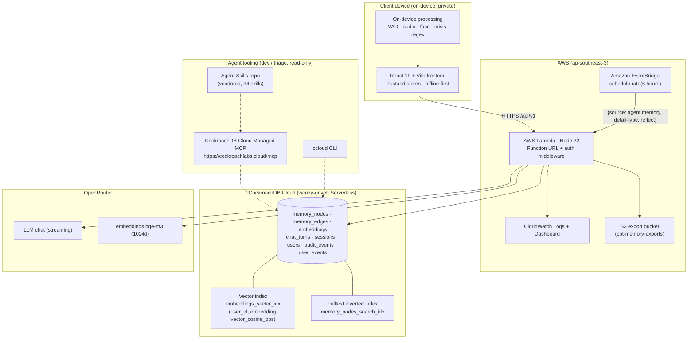
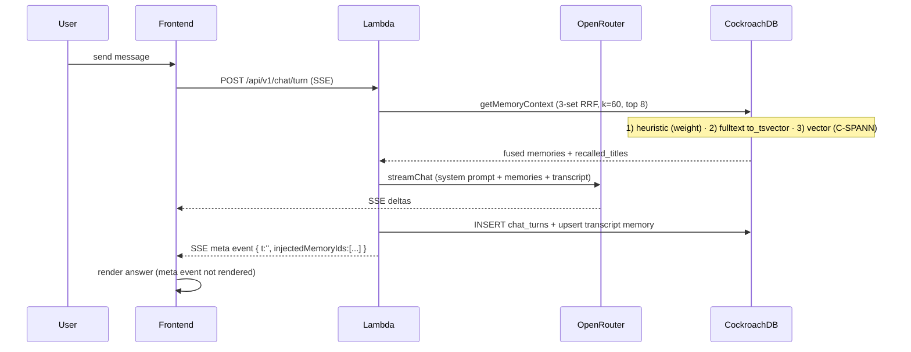
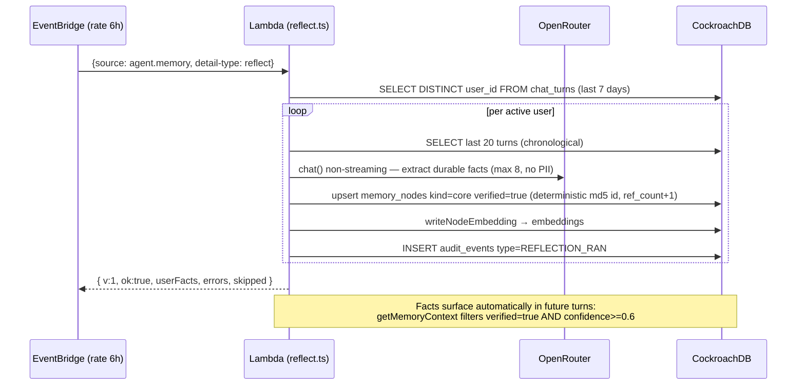

# Architecture — CBT Memory Agent × CockroachDB × AWS

> Dokumen ini adalah **artefak submission** (requirement: optional architecture diagram).
> Diagram mermaid dapat dirender di GitHub atau `mermaid.live`. Status: 2026-08-16.

## High-level overview



## Request path — chat turn (agentic memory loop)



## Scheduled reflection job (EventBridge)



## Security boundaries

- **Read vs write**: Lambda data-plane is the only writer (pg Pool, auth middleware).
  Managed MCP is read-only agent tooling — never wired into Lambda runtime.
- **Zero PII in LLM prompts**: name/email/phone never sent to OpenRouter; reflection
  prompt explicitly forbids PII extraction.
- **BYOK on device**: API keys encrypted in IndexedDB + WebCrypto; never leave device.
- **Audit**: every mutation recorded in `audit_events` (including `REFLECTION_RAN`).
- **Spend limit**: cluster serverless spend_limit $0.00; OpenRouter daily cap via SSM.

## Tooling map (submission matrix)

| Category | Tool | Live proof |
|---|---|---|
| CRDB tool 1 | Cloud Managed MCP (read-only) | `docs/15-8-26/mcp-proof/` |
| CRDB tool 2 | Distributed Vector Indexing (C-SPANN + fulltext) | `embeddings_vector_idx`, `memory_nodes_search_idx` |
| CRDB tool 3 | ccloud CLI (provision + audit) | `scripts/ccloud-audit.sh` (6/6 PASS) |
| CRDB tool 4 | Agent Skills repo (vendored) | `skills/cockroachdb-skills/` |
| AWS 1 | Lambda | Function URL live (`/api/v1/health` OK) |
| AWS 2 | S3 | `cbt-memory-exports` |
| AWS 3 | EventBridge | `cbt-memory-agent-reflect` rule |
| AWS 4 | CloudWatch | Logs + dashboard + health gate |
| LLM | OpenRouter | chat + embeddings |

## Deployment

```text
GitHub Actions (deploy.yml)
  → lambda: npx tsc --noEmit + npm test (99 tests)
  → ccloud-audit.sh --quiet (health gate)
  → build-lambda.sh → zip
  → terraform init/apply (TF_VAR_* secrets from GitHub secrets)
  → health curl

Terraform modules: apigw, budget, eventbridge, iam, lambda, ssm
Backend: S3 bucket cbt-memory-agent-terraform-state-apse3
```
